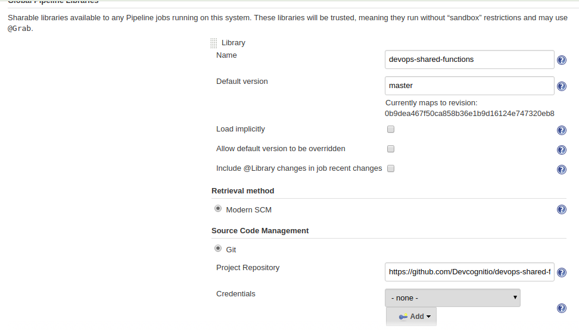

# devops-shared-functions
Funciones compartidas para jenkins pipelines

## Uso de gradle en el proyecto
```shell
# clean
./gradlew clean

# test
./gradlew test

# build
./gradlew build
```

## Configuración del ambiente para probarla
Para probar facilmente la librería se construyeron unas imagenes en docker hub que facilitan la configuración de un ambiente para testear la librería, a continuación se describen los pasos para configurar este ambiente.

### Repos en docker hub
[Repo Jenkins](https://cloud.docker.com/u/devcognitio/repository/docker/devcognitio/jenkins-sql)
[Repo sql-server](https://cloud.docker.com/u/devcognitio/repository/docker/devcognitio/sql-server-jenkins)

### Pre-requisitos
Instalar:
1. [Docker](https://docs.docker.com/install/)
2. [sqlcmd](https://www.npmjs.com/package/sqlcmdjs)
3. java
4. gradle

### Instalación de los contenedores
Una vez se tengan todos los pre-requisitos, se deben ejecutar los siguientes comandos para descargar y ejecutar los contenedosres:
```shell
docker pull devcognitio/sql-server-jenkins

docker pull devcognitio/jenkins-sql

# El usuario/clave para conectarte a la BD es: sa/admin123.
docker run -d --name my-sql-server -e 'ACCEPT_EULA=Y' -e 'SA_PASSWORD=admin123.' -p 1433:1433 devcognitio/sql-server-jenkins

docker run -d --name my-jenkins -v jenkins_home:/var/jenkins_home -p 8080:8080 -p 50000:50000 --link my-sql-server:my-sql-server devcognitio/jenkins-sql

# Para subir los contenedores
docker start my-sql-server my-jenkins

# Para detener los contenedores
docker stop my-sql-server my-jenkins

```
NOTA: Tener en cuenta que el comando que `docker run` para jenkins mostrará en consola un código, este código debe ser copiado para usarlo cuando se requiera subir por primer vez jenkins.
Cuando se use por primer vez y se pretenda crear el usuario y constraseña de jenkins, se recomienda usar `admin/admin123.`.

Luego prueba que todo está bien:

```shell
# Prueba sql-server
sqlcmd -s 127.0.0.1 -u sa -p admin123. "select GETDATE()"

#respuesta esperada similar a:
[{"":"2019-01-14T21:21:38.900Z"}]

```
Para probar jenkins ingresas a la ruta: 
(localhost:8080)[localhost:8080]

### Otras configuraciones en jenkins para que funcione OK la librería
1. Configurar la librería compartida: Ir a Jenkins/Administrar Jenkins/Configurar el Sistema/		
Global Pipeline Libraries

allí se configura como se muestra en la imagen:


url de la librería: `https://github.com/Devcognitio/devops-shared-functions`

2. Ir a Jenkins/Credentials/system/global credentials y crear una nueva con la siguiente información:
*ID:* `SQL_SERVER_CREDENTIALS`
*Descrption:* `SQL_SERVER_CREDENTIALS`
*Username:* `sa`
*Password:* `admin123.`

3. Ir a Jenkins y crear un nuevo pipeline usando repositorio git, para esto se creó un proyecto de ejemplo que tiene scripts sql que pueden ser ejecutados:

url del proyecto: ``

4. Ejecutar el proyecto y verificar que se obtengan buenas salidas para la ejecución de los scripts:

```shell
Rute: /var/jenkins_home/workspace/bd_executir/bd/scripts
[Pipeline] isUnix
[Pipeline] sh
+ ls /var/jenkins_home/workspace/bd_executir/bd/scripts
[Pipeline] echo
filesList : [prueba3.sql, prueba4.sql, prueba5.sql], class: class java.util.ArrayList
[Pipeline] echo
Path: >>>/var/jenkins_home/workspace/bd_executir/bd/scripts/prueba3.sql<<<
[Pipeline] sh
+ sqlcmd -s 172.17.0.2 -o 1433 -u **** -p ****+ 
cat /var/jenkins_home/workspace/bd_executir/bd/scripts/prueba3.sql
[{"":"Microsoft SQL Server 2017 (RTM-CU13) (KB4466404) - 14.0.3048.4 (X64) \n\tNov 30 2018 12:57:58 \n\tCopyright (C) 2017 Microsoft Corporation\n\tDeveloper Edition (64-bit) on Linux (Ubuntu 16.04.5 LTS)"}]
[Pipeline] echo
Path: >>>/var/jenkins_home/workspace/bd_executir/bd/scripts/prueba4.sql<<<
[Pipeline] sh
+ cat /var/jenkins_home/workspace/bd_executir/bd/scripts/prueba4.sql
+ sqlcmd -s 172.17.0.2 -o 1433 -u **** -p ****
[{"PersonID":123,"LastName":"Perez","FirstName":"Jennifer","Address":"B123","City":"Medellin"},{"PersonID":345,"LastName":"Beltran","FirstName":"Johan","Address":"B123","City":"Lima"}]
[Pipeline] echo
Path: >>>/var/jenkins_home/workspace/bd_executir/bd/scripts/prueba5.sql<<<
[Pipeline] sh
+ cat /var/jenkins_home/workspace/bd_executir/bd/scripts/prueba5.sql
+ sqlcmd -s 172.17.0.2 -o 1433 -u **** -p ****
[Pipeline] }
[Pipeline] // withCredentials
[Pipeline] }
[Pipeline] // script
[Pipeline] }
[Pipeline] // stage
[Pipeline] }
[Pipeline] // withEnv
[Pipeline] }
[Pipeline] // node
[Pipeline] End of Pipeline
Finished: SUCCESS
```